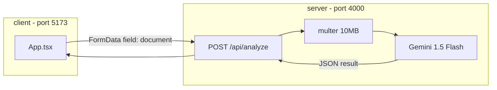

# DocRisk Sri Lanka — Project Plan

## What you have today

A working **document fraud analysis** stack: React uploads a file, Express sends it to **Gemini 1.5 Flash**, and the UI shows structured risk results. Firebase auth was intentionally skipped for local testing.



## Key files

| Layer | File | Role |
|-------|------|------|
| Types | [client/src/types.ts](client/src/types.ts) | `AnalysisResult`, `AnalyzeApiResponse`, `DocumentType`, `RiskLevel` |
| UI | [client/src/App.tsx](client/src/App.tsx) | Upload, preview, `fetch` to API, results UI |
| Styles | [client/src/App.css](client/src/App.css), [client/src/index.css](client/src/index.css) | Dark minimalist theme |
| API | [server/src/index.ts](server/src/index.ts) | CORS, multer, Gemini prompt, `/api/analyze` |
| Config | [server/package.json](server/package.json) | `npm run dev` → `tsx src/index.ts` |
| Config | [client/package.json](client/package.json) | `npm run dev` → Vite |

## API contract

**Request:** `POST http://localhost:4000/api/analyze`  
- Body: `multipart/form-data` with field name **`document`** (must match multer in server)

**Success response:**
```json
{ "success": true, "result": { "document_type", "risk_score", "risk_level", "summary", "red_flags", "explanation", "recommended_action" } }
```

**Error response:**
```json
{ "success": false, "error": "message" }
```

Frontend checks: `res.ok`, `data.success`, and `data.result` before rendering ([client/src/App.tsx](client/src/App.tsx) ~lines 111–118).

## How to run (two terminals)

**Terminal 1 — backend**
```powershell
cd C:\Users\Lenovo\Desktop\DocRisk-Sri-lanka\server
npm run dev
```
Requires `GEMINI_API_KEY` in `server/.env`. Server listens on **http://localhost:4000**.

**Terminal 2 — frontend**
```powershell
cd C:\Users\Lenovo\Desktop\DocRisk-Sri-lanka\client
npm run dev
```
Open **http://localhost:5173**.

Common mistake: running `npm run dev` from `server` or repo root before the server script was added — only **`client`** had `dev` originally; **`server`** now has it too.

## UI flow (implemented)

1. Drag-and-drop or click to select `.pdf`, `.jpg`, `.jpeg`, `.png` (max 10 MB)
2. Preview (image thumbnail or PDF icon) + **Analyze Document**
3. Loading state: spinner + pulsing **Analyzing...**
4. Results: document type badge, risk ring + bar, color-coded risk level (`getRiskColor`), summary, red flags (Lucide `AlertTriangle`), expandable explanation, recommended action box

## Known gaps / cleanup (optional)

- **[server/src/services/gemini.ts](server/src/services/gemini.ts)** — older passport/ID prompt and imports stale `AnalysisResult` shape; **not used** by the live server (logic is inline in `index.ts`). Safe to delete or align later.
- **Hardcoded API URL** in [client/src/App.tsx](client/src/App.tsx): `http://localhost:4000/api/analyze` — fine for dev; use `import.meta.env.VITE_API_URL` for production.
- **No root `package.json`** — no single command to start both apps; could add later with `concurrently`.
- **Firebase** — listed in dependencies but not wired; add only when you want auth/storage.

## Suggested next steps (pick what you need)

### Phase A — Stabilize local dev
- Confirm `server/.env` has valid `GEMINI_API_KEY`
- Test one PDF and one image end-to-end
- If Gemini returns non-JSON, improve error handling in [server/src/index.ts](server/src/index.ts) (try/catch around `JSON.parse`)

### Phase B — Production readiness
- Add `VITE_API_URL` in client `.env` and read it in `App.tsx`
- Add rate limiting and stricter MIME validation on upload
- Deploy server (Railway, Render, Cloud Run) and client (Vercel, Netlify, Firebase Hosting)

### Phase C — Firebase (when requested)
- Auth (email/Google) on client
- Optional: store analysis history in Firestore
- Lock API behind Firebase ID token verification on server

## Test checklist

- [ ] Server prints `Server running on http://localhost:4000`
- [ ] Client opens at `http://localhost:5173`
- [ ] Invalid file type shows error on dropzone
- [ ] File over 10 MB is rejected
- [ ] Valid upload shows preview + Analyze button
- [ ] Analyze shows loading then full result fields
- [ ] Network tab shows `POST` to `/api/analyze` with `document` in FormData
