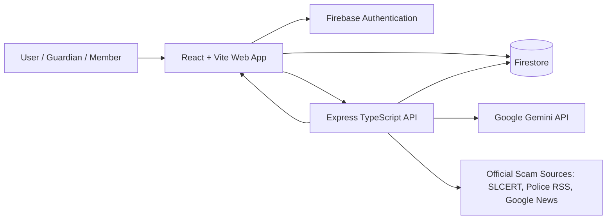

# Cursor Buildathon Project Submission Document

## Section 01: Project Overview

### Project Name & One-Line Pitch

**Project Name:** DocRisk Sri Lanka

**One-Line Pitch:** DocRisk Sri Lanka helps Sri Lankan citizens, families, and small organizations detect risky documents, scam links, and suspicious voice/audio evidence using AI-powered fraud analysis before they lose money or share sensitive information.

### Summary

DocRisk Sri Lanka addresses the growing problem of document fraud, phishing, impersonation, and digital scams affecting everyday Sri Lankans. Users can upload documents such as job offers, land deeds, visa letters, certificates, bank notices, NIC scans, PDFs, images, or DOCX files and receive a clear AI-generated risk score, red flags, extracted fields, and recommended next steps. The product also includes link checking, forensic audio analysis, official scam advisories, saved history, guardian protection flows for family members, and an admin dashboard for fraud telemetry. It is designed for non-technical users who need fast, understandable guidance in high-pressure situations.

### Submission Details

- **Track Name:** Gemini Track
- **Track Technology Integration:** Gemini is meaningfully integrated as the core AI engine for document analysis, suspicious link analysis, audio forensic analysis, and scam guidance chat. The product depends on Gemini to convert uploaded evidence into structured fraud-risk decisions.
- **Team Name:** `[Add team name]`
- **Demo URL:** `[Add deployed demo URL]`
- **Repository Link:** `[Add repository link]`

## Section 02: Problem Statement

### The Problem

Sri Lankan citizens regularly receive documents and digital messages that look official but may be fraudulent: fake foreign job offers, visa letters, forged certificates, altered NIC images, suspicious bank notices, land-related documents, scam links, and voice messages. The people most affected are job seekers, migrant workers, older adults, families, small businesses, and anyone who must make quick decisions based on a document or message they cannot easily verify. If left unsolved, users may send money to scammers, expose identity information, sign fraudulent agreements, travel based on fake approvals, or ignore legitimate warnings because they cannot separate real from fake.

### Why It Matters

The problem is frequent and severe because scams target high-value life events: employment, migration, land ownership, banking, education, and family safety. A single mistake can cause financial loss, identity theft, emotional stress, or legal complications. Today, people usually rely on calling a friend, posting in a WhatsApp group, manually searching online, visiting an office, or guessing based on appearance. Those workarounds are slow, inconsistent, and unavailable at the exact moment a scammer is pressuring the victim to act quickly.

### Root Cause

The root cause is an information and verification gap. Fraudsters can now create convincing documents, links, and voice content faster than ordinary people can verify them. Official verification channels are fragmented, not always digital, and often difficult for non-technical users to navigate. Users need a simple first-line risk assessment that translates technical fraud signals into clear local advice.

## Section 03: Proposed Solution

### What the Product Does

DocRisk Sri Lanka gives users a simple interface to upload a document, paste/check a link, or analyze an audio clip. The backend validates the input, sends the evidence to Gemini with a Sri Lanka-specific forensic prompt, parses the AI response into a strict structured schema, and returns a user-friendly result with a risk score, risk level, red flags, explanation, extracted fields, and recommended action. For family safety, guardians can create protected member links so older adults or vulnerable family members can submit suspicious links or documents without creating a full account.

The core mechanism is a controlled AI analysis pipeline: deterministic validation for obvious local formats such as NIC numbers, strict file limits and MIME checks, Gemini multimodal reasoning for document/audio evidence, JSON-only response contracts, frontend result rendering, and Firebase persistence for authenticated history and guardian workflows.

### Key Features

- **AI document fraud analysis:** Users upload PDFs, images, DOCX files, or NIC scans and receive a risk score, risk level, explanation, red flags, extracted data, and recommended action.
- **Visual tamper region detection:** For image documents, Gemini can return normalized bounding boxes for suspicious edited regions, and the frontend overlays them on the preview.
- **Sri Lankan NIC pre-validation:** NIC uploads can be checked locally and on the server for format validity, birth year, gender, and year conflicts before spending an AI request.
- **Multilingual output:** Key analysis text can be generated in English, Sinhala, or Tamil while preserving structured JSON fields.
- **Suspicious link checker:** Family members can submit links for Gemini-based phishing/scam analysis focused on Sri Lankan banks, government portals, telcos, OTP theft, prizes, and job/visa scams.
- **Audio forensic analysis:** Users can upload MP3, WAV, WebM, or OGG audio for deepfake, replay attack, splicing, and synthetic speech risk assessment.
- **Official scam feed:** The app aggregates active scam advisories from SLCERT, Sri Lanka Police RSS, and Google News fraud results.
- **Expert scam chat:** Users can ask follow-up questions about active scams and receive short, local, actionable guidance.
- **Firebase authentication and history:** Signed-in users can save and review previous analyses.
- **Guardian mode:** A guardian can create a family circle, add protected members, share check links, receive notifications, and review member check history.
- **Admin dashboard:** Authorized admins can view aggregate fraud telemetry such as total analyses, risk breakdown, document type distribution, and average risk score.

### Scope

**In scope for this build:**

- Web application frontend built with React and Vite.
- TypeScript/Express backend with Gemini API integration.
- Document, link, and audio analysis flows.
- Firebase Authentication and Firestore-backed user analysis history.
- Guardian circle, member check link, notifications, and history features.
- Admin-only telemetry dashboard.
- Official scam advisory aggregation and caching.
- Basic PWA support for member check access.

**Deliberately left out due to time constraints:**

- Direct integration with government, bank, employer, or land registry verification databases.
- Human expert review marketplace.
- Production-grade payment system.
- Full SMS/WhatsApp alert delivery; current notifications are in-app/browser based.
- Automated legal reporting workflow.
- Enterprise multi-tenant administration.
- Formal AI accuracy benchmarking against a labeled fraud dataset.

## Section 04: Functional Requirements

### Must Have

- The system must allow an authenticated user to sign up, sign in, and sign out using Firebase Authentication.
- The system must allow a user to upload a supported document file: PDF, JPG, JPEG, PNG, or DOCX.
- The system must reject unsupported document file types and files larger than 10 MB.
- The system must send valid document uploads to the backend analysis API.
- The backend must call Gemini with a Sri Lanka-specific fraud analysis prompt.
- The backend must return a structured result containing document type, risk score, confidence, risk level, summary, red flags, explanation, recommended action, extracted data, and optional tamper coordinates.
- The frontend must display the analysis result in a clear risk dashboard.
- The system must support English, Sinhala, and Tamil output for user-facing analysis text.
- The system must validate Sri Lankan NIC numbers for NIC-specific submissions before running AI analysis.
- The system must save completed user analyses to Firestore when Firebase is configured.
- The guardian feature must let a signed-in guardian add protected family members and generate shareable check links.
- A member check link must let a protected member submit either a suspicious link or document.
- The system must notify the guardian and store the completed member check result.
- The system must expose a health endpoint for backend status.

### Should Have

- The system should show visual tamper boxes on image previews when Gemini identifies suspicious edited regions.
- The system should provide audio forensic analysis for voice scam, deepfake, splicing, and replay detection.
- The system should aggregate official scam advisories from Sri Lankan and relevant public sources.
- The system should allow users to chat with an AI fraud guidance assistant about active scam advisories.
- The system should provide an admin-only fraud telemetry dashboard.
- The system should rate-limit API requests in production.
- The system should provide meaningful error messages for Gemini API failures, invalid credentials, quota exhaustion, and invalid model configuration.
- The system should support PWA-style installation prompts for member check access.

### Could Have / Won't Have This Build

- The system could integrate official registry APIs for real-time document verification.
- The system could send SMS or WhatsApp alerts to guardians.
- The system could provide a human escalation queue for high-risk cases.
- The system could provide organization accounts for banks, recruiters, universities, or government offices.
- The system could generate formal fraud reports for law enforcement.
- The system won't process payments in this build.
- The system won't claim legal certainty; it provides risk guidance and recommended next steps.

## Section 05: Non-Functional Requirements

### Performance

- Document upload validation should happen immediately on the frontend before API submission.
- For supported files under 10 MB, the expected document analysis response should complete within roughly 5-20 seconds depending on Gemini latency, file size, and network conditions.
- Link checks should generally return faster than document analysis because they use text-only reasoning.
- Official scam advisories are cached for 30 minutes to avoid repeated slow external fetches.
- Under concurrent usage, the Express API can serve multiple requests, while production rate limiting can cap abuse to a configurable request limit.

### Reliability & Error Handling

- The backend handles missing files, invalid MIME types, oversized uploads, invalid URLs, missing API keys, Gemini model errors, unparsable AI JSON, quota failures, and authentication failures.
- AI responses are requested as JSON and parsed into a known schema before the frontend uses them.
- Tamper coordinates and extracted fields are sanitized before being returned.
- Official scam feed loading uses multiple sources; one source can fail while others still contribute results.
- Firestore telemetry writes are non-blocking, so analysis can still succeed if telemetry persistence fails.

### Usability

- The interface uses clear risk levels, color-coded status, short summaries, red flag lists, and direct recommended actions.
- The product avoids technical language where possible, especially in the member check flow.
- Guardian mode is designed for family protection, allowing a non-technical member to use a link instead of managing an account.
- The app supports dark/light theme switching.
- Accessibility considerations include semantic labels, visible state changes, keyboard-focusable tamper boxes, and simple result language.

### Scalability

- To handle significantly more load, the backend should be deployed as a horizontally scalable API service with queueing for expensive AI jobs.
- File uploads should move from in-memory processing to object storage for larger workloads.
- Firestore indexes should be tuned for high-volume history and guardian queries.
- Rate limits, authentication enforcement, observability, and retry policies should be enabled in production.
- The current separation between React client, Express API, Gemini services, and Firestore data storage supports future scaling by component.

## Section 06: Technical Architecture

### System Overview

DocRisk uses a React/Vite frontend, a TypeScript Express API, Gemini AI services, Firebase Authentication, and Firestore. The frontend handles authentication, upload forms, previews, result rendering, guardian dashboards, admin pages, and user history. The backend validates inputs, enforces optional Firebase ID token verification, calls Gemini, sanitizes model output, writes telemetry to Firestore, and serves guardian/admin APIs.

### Technology Stack

- **Frontend:** React 19, TypeScript, Vite, React Router, Lucide/Tabler icons. Chosen for fast iteration, component-based UI, and strong TypeScript contracts.
- **Backend:** Node.js, Express 5, TypeScript, tsx. Chosen for a simple API layer that can handle uploads, Gemini calls, and Firebase Admin integration.
- **AI/ML:** Google Gemini via `@google/genai`. Gemini 2.5 Flash is used for multimodal document/audio analysis, and Gemini 1.5 Flash is used for URL checking.
- **Authentication:** Firebase Authentication for user login and ID tokens.
- **Database:** Firestore for user analysis history, guardian circles, member check requests, notifications, admin config, and fraud telemetry.
- **File Upload Handling:** Multer memory storage with size and MIME validation.
- **Document Text Extraction:** Mammoth for DOCX raw text extraction before Gemini analysis.
- **Security/Abuse Controls:** Firebase Admin token verification, Firestore rules, Express rate limiting, server-side secret management.
- **Hosting:** Frontend can be deployed to Vercel or Firebase Hosting; backend can be deployed to Render, Railway, Cloud Run, or another Node-compatible service. `[Confirm actual hosting used for demo]`
- **Third-Party Data Sources:** SLCERT knowledge base, Sri Lanka Police RSS, Google News RSS.

### Data Flow

Core document analysis flow:

1. User signs in through Firebase Authentication.
2. User selects language and document type, then uploads a supported file.
3. Frontend checks extension, size, and optional NIC format before upload.
4. Frontend sends multipart form data to `POST /api/analyze` with Firebase ID token.
5. Backend verifies token when Firebase Admin is configured.
6. Backend validates MIME type and file size using Multer.
7. For NIC submissions, backend performs deterministic NIC pre-validation.
8. Backend converts file data to base64 or extracts DOCX text with Mammoth.
9. Backend calls Gemini with a strict forensic prompt and JSON response requirement.
10. Backend parses and sanitizes the Gemini response.
11. Backend optionally writes fraud telemetry to Firestore.
12. Frontend receives the result and displays the risk dashboard, extracted fields, red flags, and tamper overlays.
13. Frontend saves the analysis to the signed-in user's Firestore history.

Guardian member check flow:

1. Guardian signs in and creates a protected member in the guardian dashboard.
2. System generates a secure member token and check link.
3. Member opens `/check?token=...` and submits a suspicious link or document.
4. Backend resolves the member token, runs link or document analysis, stores the result in `check_requests`, and creates a guardian notification.
5. Guardian reviews the result in activity/history pages.

### AI Integration

- **Provider:** Google Gemini through the `@google/genai` SDK.
- **Document model:** Configurable through `GEMINI_MODEL`, defaulting to `gemini-2.5-flash`.
- **URL model:** `gemini-1.5-flash`.
- **Prompting approach:** The backend uses system prompts that define the role, local Sri Lankan fraud criteria, output schema, allowed document types, risk scoring rules, tamper-coordinate rules, and language output rules.
- **Role in UX:** Gemini converts unstructured evidence into a structured fraud assessment that the UI can present as a simple decision-support dashboard.

### Known Technical Limitations

- Gemini output quality depends on document clarity, image crop, language visibility, and model availability.
- The app does not verify documents against official government or bank databases.
- Firestore security for public member check creation is intentionally permissive for the hackathon flow and should be tightened for production.
- Audio analysis is forensic guidance, not court-admissible proof.
- The current backend uses in-memory upload handling, which is acceptable for 10 MB hackathon uploads but should be replaced with object storage for scale.
- Demo hosting details are not stored in the repo and must be added manually.

## Section 07: Security

### Authentication & Authorisation

Users authenticate through Firebase Authentication. The frontend obtains Firebase ID tokens and sends them to protected backend routes. The backend can verify tokens using Firebase Admin when `FIREBASE_PROJECT_ID` and credentials are configured. Admin access is controlled by a Firestore allowlist document and checked server-side, so admin UID lists are not exposed to the browser. Guardian data is scoped to the authenticated guardian's UID.

### Data Handling

User analysis results are saved under `users/{userId}/analyses`, which Firestore rules restrict to the owning user. Guardian circles, members, notifications, and check history are stored in Firestore and scoped by guardian ID. Uploaded files are processed in memory and are not intentionally persisted by the backend in this build; analysis results and metadata are persisted instead. Firebase handles credential/session security, while Firestore rules restrict client reads and writes.

### API & Secret Management

Gemini API keys and Firebase Admin credentials are read only from backend environment variables such as `GEMINI_API_KEY`, `GEMINI_MODEL`, `FIREBASE_PROJECT_ID`, and `GOOGLE_APPLICATION_CREDENTIALS`. Secrets are not required in the frontend. Frontend Firebase configuration uses public `VITE_FIREBASE_*` values, while privileged admin credentials remain server-side. The repository should not commit `.env` files or service account JSON files.

### Input Validation

The frontend and backend both validate file type and size. The backend rejects invalid MIME types, missing files, and files over 10 MB. URL analysis accepts only `http` and `https` URLs. NIC submissions are checked with deterministic validation before Gemini analysis. Gemini output is parsed as JSON, sanitized, and clamped for fields such as risk score, confidence, and tamper coordinates.

### Known Vulnerabilities or Gaps

- Public member check creation is allowed by the Firestore rules for usability; production should enforce backend-only creation or App Check.
- There is no malware scanning on uploaded files in this build.
- Rate limiting is configurable and production-oriented but should be verified in the deployed environment.
- No full audit log or SIEM integration is included.
- No formal penetration testing was completed during the buildathon timeframe.

## Section 08: User Stories & Use Cases

### Core User Stories

- As a job seeker, I want to upload a job offer letter so that I can know whether it may be fake before paying an agent.
- As a parent, I want to check a visa or certificate document so that I can protect my family from fraudulent migration promises.
- As a land buyer, I want to scan a deed or related document so that I can identify obvious red flags before continuing.
- As an older adult, I want to submit a suspicious link through a simple family-provided page so that I can avoid phishing without needing a full account.
- As a guardian, I want to add family members and share check links so that they can ask for help before clicking or signing anything.
- As a guardian, I want to receive notifications when a family member completes a check so that I can follow up quickly on risky results.
- As a user, I want results in Sinhala, Tamil, or English so that I can understand the risk clearly.
- As a fraud analyst/admin, I want to see aggregate risk telemetry so that I can understand common fraud patterns.
- As a user who receives a suspicious voice message, I want to analyze the audio so that I can detect possible deepfake, replay, or splicing signals.
- As a user reading scam news, I want official scam advisories in one place so that I can stay aware of current local threats.

### Primary Use Case Walkthrough

1. A user receives a suspicious foreign job offer asking for urgent payment.
2. The user signs in to DocRisk Sri Lanka.
3. The user selects the document type, preferred output language, and uploads the offer letter.
4. The frontend validates the file and sends it to the backend.
5. The backend verifies the request, validates the upload, and sends the document to Gemini.
6. Gemini returns a structured fraud analysis with risk score, red flags, explanation, and recommended action.
7. The frontend displays a clear risk dashboard, including red flags such as urgency, unofficial email domains, missing registration data, or formatting inconsistencies.
8. The analysis is saved to the user's history.
9. The user decides not to pay and follows the recommended action, such as verifying through official channels or reporting the scam.

### Edge Cases

- If the user uploads an unsupported file type, the system rejects it before analysis.
- If the file exceeds 10 MB, the system returns a clear size error.
- If a NIC number is missing or malformed for a NIC upload, the system blocks analysis and explains the issue.
- If Gemini returns invalid JSON or an empty response, the backend returns a retry-friendly error.
- If Firebase is not configured, the app can show setup guidance or limit persistence features.
- If an official scam source fails, other sources can still provide advisories.
- If a member token is invalid, the member check page refuses access.
- If an audio file has an unsupported MIME type, the backend rejects it with a clear message.

## Section 09: Target Users & Market

### Primary User

The primary user is a Sri Lankan citizen or family member who receives a document, link, or voice message that may be fraudulent but does not have the expertise or time to verify it. The first target segment is families protecting older adults, job seekers applying through agents, and people handling migration, land, education, or banking documents.

### Market Opportunity

The market is the broader fraud-prevention and digital trust space in Sri Lanka, starting with consumer protection and family safety. The immediate opportunity is high because scams increasingly happen through WhatsApp, email, social media, fake PDFs, forged letters, and voice calls. A local-first, multilingual, AI-powered risk assistant can become the first place users check before clicking, paying, signing, or sharing personal information.

### Competitive Landscape

- **Manual Google search / social media posts:** Easy to access but unreliable, slow, and not specific to the user's exact document or link.
- **Official hotlines and in-person verification:** More authoritative but often slow, fragmented, and unavailable at the moment of pressure.
- **Generic antivirus/phishing tools:** Useful for known malicious links but weak for local document fraud, Sinhala/Tamil content, forged paperwork, and family workflows.
- **Asking friends or family:** Helpful but inconsistent and dependent on who is available.

## Section 10: Business Model

### Revenue Model

DocRisk can use a freemium SaaS model. Basic checks would be free or low-cost for consumers, while paid plans could unlock higher monthly limits, guardian circles, saved history, admin analytics, enterprise reporting, and priority processing. Usage-based pricing fits AI costs because each document, audio file, or link check consumes compute.

### Pricing Hypothesis

- **Free tier:** Limited monthly checks for individuals to encourage adoption and public safety.
- **Family plan:** LKR 500-1,500 per month for guardian circles, history, and higher limits.
- **Professional/SME plan:** LKR 3,000-10,000 per month for recruiters, schools, agents, law offices, or small businesses that review many documents.
- **Enterprise/API plan:** Custom pricing for banks, telcos, recruitment platforms, insurers, or government partners.

This pricing fits the product because the value is prevention. Avoiding one scam can save far more than the monthly subscription cost.

### Go-to-Market

The first ten customers/users would be acquired through direct outreach and community demonstrations:

- Run demos for job seekers, university students, migrant worker communities, and family groups.
- Partner with cyber safety educators, TechTalk360 communities, and local creator channels.
- Approach small recruitment agencies, migration consultants, and legal/document service offices.
- Share real scam examples and show "before payment, check with DocRisk" messaging.
- Offer free guardian setup for families with older adults as an adoption wedge.

### Roadmap

- **Now:** Document analysis, link checks, audio forensics, official scam feed, Firebase auth/history, guardian mode, admin telemetry.
- **0-3 months:** Production deployment, stronger security rules, App Check, SMS/WhatsApp alerts, better analytics, labeled test dataset, improved Sinhala/Tamil UX, and official reporting guidance.
- **1 year:** Partnerships with banks, telcos, recruitment platforms, government agencies, and fraud reporting bodies; verified document workflows; mobile app; API access; enterprise dashboards; human review escalation.

## Section 11: Why This Project Leads the Track

### Technical Edge

DocRisk is not a thin wrapper around a chatbot. It uses Gemini as a structured multimodal fraud engine across documents, links, audio, scam advisories, and follow-up guidance. The system includes strict JSON prompting, schema parsing, deterministic NIC validation, image tamper coordinate overlays, multilingual output, Firebase-backed history, guardian workflows, admin telemetry, and official scam-source aggregation. That depth makes the AI integration central to the product rather than decorative.

### Problem-Solution Fit

The problem is urgent, local, and painful: people lose money and trust because they cannot verify digital evidence quickly. The solution directly matches that need by letting users upload the exact suspicious item and receive plain-language risk guidance in seconds. The guardian flow also recognizes a real-world truth: many scam victims need help from family members but may not be comfortable using complex security tools.

### Execution Quality

The demo can show multiple working workflows: sign in, upload document, receive structured analysis, view tamper overlays, switch language, save history, check a link, analyze audio, browse active scams, create a guardian member, submit a member check, and view notifications/history. For a buildathon project, the product has breadth, local specificity, and a polished user experience.

### Real-World Potential

DocRisk can continue beyond the hackathon because it addresses a persistent fraud problem with a practical first-line verification tool. The path to growth is clear: families, job seekers, migration-related communities, SMEs, schools, and eventually enterprise or public-sector partners. The product can become a trusted safety layer before users click, pay, sign, or share identity data.

## Section 12: Team & Roles

### Team Members

- **`[Name 1]` — Full-stack / AI Integration:** Built the React frontend, Express backend, Gemini analysis pipeline, and result UI. Background: `[Add relevant background]`.
- **`[Name 2]` — Product / UX / Research:** Defined the Sri Lankan fraud use cases, user flows, guardian experience, and demo story. Background: `[Add relevant background]`.
- **`[Name 3]` — Backend / Firebase / Security:** Implemented Firebase Auth, Firestore data model, guardian workflows, admin checks, and security rules. Background: `[Add relevant background]`.
- **`[Name 4]` — Design / Presentation / Testing:** Polished the UI, prepared the pitch, tested demo scenarios, and documented edge cases. Background: `[Add relevant background]`.

> Replace or remove rows above based on the actual team size.

### Why This Team

This team is right for the problem because it combines AI prototyping, full-stack engineering, local fraud awareness, product thinking, and user-centered design. The build shows the ability to turn a real Sri Lankan safety problem into a working product with technical depth, practical workflows, and a credible path to production.

